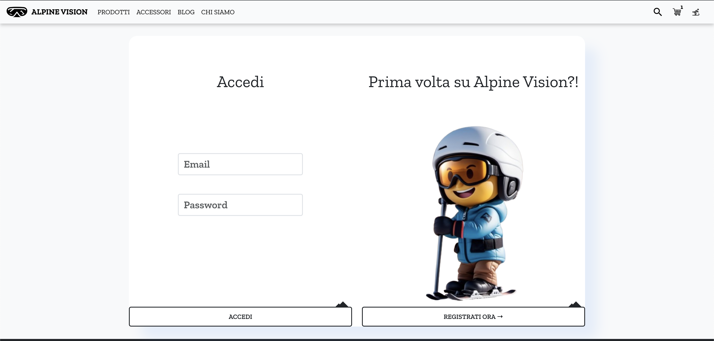

# 🏂❄️AlpineVision-LTW🏂❄️

**AlpineVision** è un progetto per la creazione di un moderno negozio online di maschere da sci intrapreso dal nostro team di quattro appassionati. Il nostro obiettivo era creare un sito web coinvolgente e visivamente sorprendente che si rivolgesse agli appassionati di sci in cerca di maschere da sci di alta qualità. Utilizzando tecnologie frontend e backend, tra cui HTML, CSS, React, Node.js e Bootstrap, abbiamo cercato di offrire un'esperienza di shopping online unica e coinvolgente.

Di seguito è fornita una descrizione delle cartelle che compongono il codice sorgente:

La cartella **Alpine Vision** è composta da due cartelle principali: **backend** e **frontend**.

## Backend

Il backend gestisce la parte server-side dell'applicazione. Questa sezione include file e configurazioni che permettono l'interazione tra l'applicazione, il database e il frontend tramite chiamate API. Il backend è strutturato nelle seguenti sottocartelle:

### Config

Questa cartella configura il database utilizzando MongoDB ospitato online tramite MongoDB Atlas. Qui sono definite le collection per:

- Prodotti
- Accessori
- Articoli del blog
- Utenti
- Carrelli
- Ordini
- Prodotti favoriti

### Images

Contiene le immagini relative a:

- Prodotti
- Accessori
- Articoli del blog

### Models

Include le funzioni principali per reperire o modellare gli elementi nelle diverse collection del database.

### Routes

Racchiude i vari endpoint disponibili per l'applicazione frontend, consentendo di eseguire operazioni di CRUD (Create, Read, Update, Delete) sui prodotti delle collection.

## Frontend

Il frontend gestisce il lato client dell'applicazione, con la seguente suddivisione:

### Public

Contiene elementi pubblici, tra cui i loghi utilizzati all'interno dello store e la pagina principale index.html.

### Src

Contiene le cartelle "assets", "components", "pages" e altri file necessari per il funzionamento dell'applicazione.

- **Assets:** Contiene immagini e video presenti all'interno delle pagine del sito, nonché script contenenti solo funzioni JavaScript richiamate nel codice delle pagine (ad esempio, le funzioni per l'editing dei prodotti) che regolano il corretto funzionamento dell'applicazione.
- **Components:** Contiene l'header e il footer dello store, elementi presenti in tutte le pagine.
- **Pages:** Contiene tutte le pagine che strutturano lo store, con relativi file .jsx e .css.

Oltre alle precedenti cartelle, sono presenti i file **App.css**, che racchiude le caratteristiche estetiche comuni a tutte le pagine, e **App.js**, che permette la visualizzazione dinamica dello store renderizzando le pagine tramite opportune route (inserite tramite la libreria "react-router-dom"). Tutta l'applicazione viene renderizzata inserendo il componente App.js all'interno di **index.js** (il quale a sua volta si occupa del "trasferimento" del codice in index.html).

## Testare lo Store

Per testare lo store, la procedura da seguire è la seguente:

1. Clonare la repository nel proprio dispositivo locale.
2. Aprire la cartella dei file, preferibilmente utilizzando un editor come Visual Studio Code.
3. Avviare il backend dalla rispettiva cartella eseguendo il comando "node server.js" nel terminale.
4. Avviare il frontend dalla rispettiva cartella eseguendo i comandi "npm install react-scripts" e "npm start" nel terminale.

